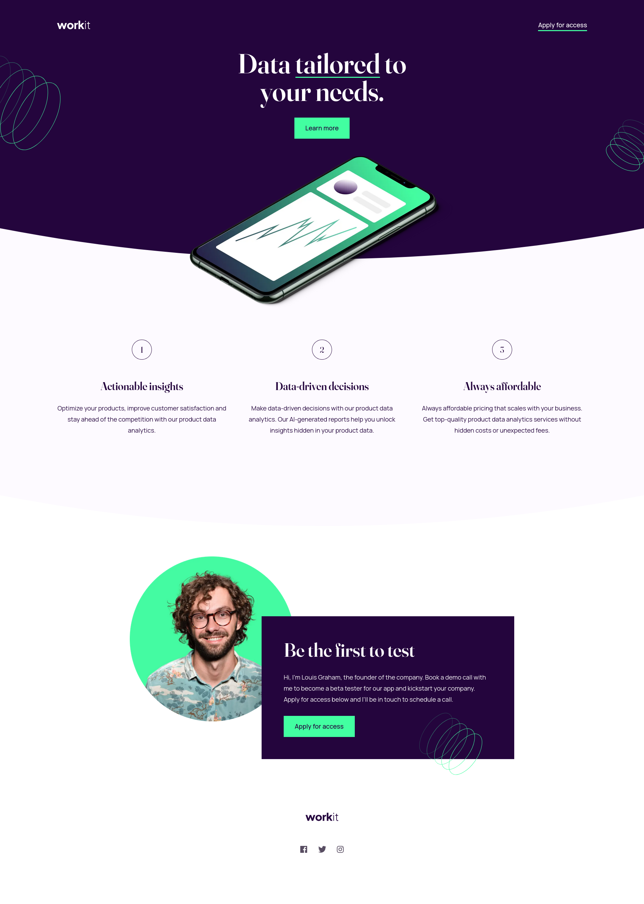

# Frontend Mentor - Workit landing page solution

This is a solution to the [Workit landing page challenge on Frontend Mentor](https://www.frontendmentor.io/challenges/workit-landing-page-2fYnyle5lu). Frontend Mentor challenges help you improve your coding skills by building realistic projects.

## Table of contents

- [Overview](#overview)
  - [The challenge](#the-challenge)
  - [Screenshot](#screenshot)
  - [Links](#links)
- [My process](#my-process)
  - [Built with](#built-with)
  - [What I learned](#what-i-learned)
  - [Continued development](#continued-development)
  - [Useful resources](#useful-resources)
- [Author](#author)

**Note: Delete this note and update the table of contents based on what sections you keep.**

## Overview

### The challenge

Users should be able to:

- View the optimal layout for the interface depending on their device's screen size
- See hover and focus states for all interactive elements on the page

### Screenshot

### Links

- Solution URL: [Add solution URL here](https://www.frontendmentor.io/solutions/workit-landing-page-razouck-DbfA7mF9F-)
- Live Site URL: [Add live site URL here](https://razouck.github.io/workit-landing-page/)

## My process

### Built with

- Semantic HTML5 markup
- CSS custom properties
- Flexbox
- Mobile-first workflow

### What I learned

Nothing new.

### Continued development

Might add animations and adjust the layout spacing to a baseline grid.

### Useful resources

- [Clamp Calculator](https://utopia.fyi/clamp/calculator/) - Helpful for fluid layouts and font-sizes.

## Author

- Frontend Mentor - [@yourusername](https://www.frontendmentor.io/profile/razouck)
- Twitter - [@yourusername](https://www.twitter.com/razouck)
- GitHub - [@yourusername](https://www.github.com/razouck)